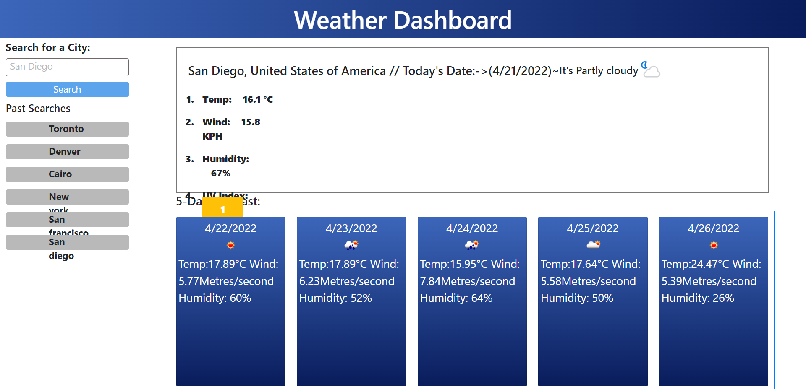

# WeatherApp

## Welcome to the Weather App! Time to check what it's like outside~

# Table of contents!

## [Preview](#Preview)

## [Description](#Description)

## [Built-with](#Built-with)

## [Website](#Website)

## [Feedback](#Feedback)

### Preview

- 

## Description

- The project's aim is to utilize API call from OpenWeather to allow users to look up the weather of their searched city and get weather information for that city.
- such information would include, Temperature, Wind speed, and Humidity levels, as well as a picture/icon representation of Sunny/Rain/Cloudy etc.
- While users have the ability to look up city weather, local storage will utlize that input and give them a saved copy of which cities they have looked up for easier useability~

## Built-with

- HTML
- CSS
- Javascript
- Bootstrap
- JQuery
- moment.js
- OpenWeather API~

## Website

[ENTER URL]

## Feedback

- Open to feedback!
- Thank you for checking out the page!
